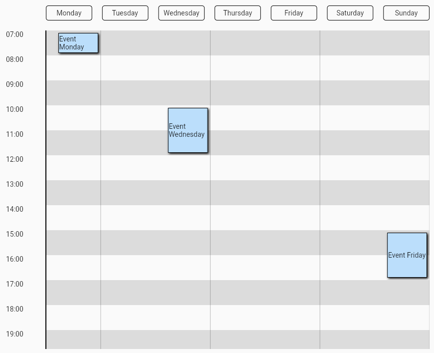
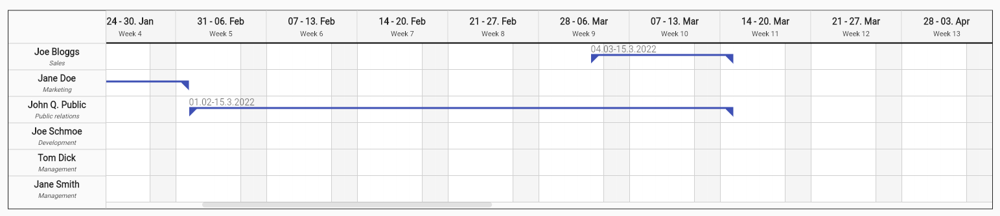

[![pub package][pub_package_badge]][pub_package_link]
[![style: very good analysis][very_good_analysis_badge]][very_good_analysis_link]
[![License: MIT][license_badge]][license_link]
[![Codecov][codecov_badge]][codecov_link]

A widget to create daily timelines, timetables, gantt charts* and more.

> Note: This package is in early stage and has not been tested with large amount of data.


### Daily timeline


### Weekly timetable




### Gantt chart




# Features
- Easy to use API.
- Rezizable timeline items.
- Custom label builder.

# Usage

## Installation
Add the following line to `pubspec.yaml`:

```yaml
dependencies:
  dynamic_timeline: ^0.1.2
```

## Basic set up
Make sure to check out the example for more details.

Dynamic timeline requires you to provide firstDateTime, lastDateTime, labelBuilder and a list of items.

- labelBuilder: Used to build the label of each mark, normally a dateFormat will be used.
- items: The events of the timeline, who are positioned according to its start and end date times.

Another important property is intervalDuration, that is the lenght of time between each mark.

Example of a daily timeline.

```dart
DynamicTimeline(
    firstDateTime: DateTime(1970, 1, 1, 7),
    lastDateTime: DateTime(1970, 1, 1, 22),
    labelBuilder: DateFormat('HH:mm').format,
    intervalDuration: const Duration(hours: 1),
    children: [
      TimelineItem(
        startDateTime: DateTime(1970, 1, 1, 7),
        endDateTime: DateTime(1970, 1, 1, 8),
        child: const Event(title: 'Event 1'),
      ),
      TimelineItem(
        startDateTime: DateTime(1970, 1, 1, 10),
        endDateTime: DateTime(1970, 1, 1, 12),
        child: const Event(title: 'Event 2'),
      ),
      TimelineItem(
        startDateTime: DateTime(1970, 1, 1, 15),
        endDateTime: DateTime(1970, 1, 1, 17),
        child: const Event(title: 'Event 3'),
      ),
    ],
),
```

[license_badge]: https://img.shields.io/badge/license-MIT-blue.svg
[license_link]: https://opensource.org/licenses/MIT
[very_good_analysis_badge]: https://img.shields.io/badge/style-very_good_analysis-B22C89.svg
[very_good_analysis_link]: https://pub.dev/packages/very_good_analysis
[pub_package_badge]: https://img.shields.io/pub/v/dynamic_timeline.svg
[pub_package_link]: https://pub.dev/packages/dynamic_timeline
[codecov_badge]: https://codecov.io/gh/IvanHerreraCasas/dynamic_timeline/branch/main/graph/badge.svg?token=NL0JPRYYB9
[codecov_link]: https://codecov.io/gh/IvanHerreraCasas/dynamic_timeline